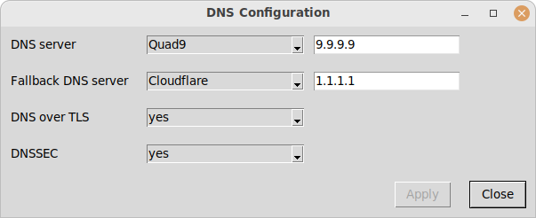

# GUI Configuration of DNS Resolution #

## Overview

This project is a simple GUI interface to the parameters of the DNS resolver
that is part of systemd. It is handy for instance when having to go through a
captive portal that the secure DNS queries.

It contains three components:

  * A GUI written in Python 3 TK (*/usr/local/bin/dns-conf.py*); it is
    essentially an editor for the configuration file
    */etc/systemd/resolved.conf*.
	
  * a helper bash script (*/usr/local/bin/dns-conf.helper.psh*);
  
  * an applet for the Cinnamon desktop that starts the GUI component
    (*/usr/share/cinnamon/applets/dnssettings@conrad.roeber*).

Modifying the configuration file and subsequent restart of the resolver
service require root priviledges. To avoid running the GUI as root, the
functions that actually require root priviledges are placed into a helper bash
script, and only this bash script is called via sudo.

For security reasons, the bash script has to be placed in a directory to which
the user does not have write access. Otherwise malicious software running in
the context of the user could modify the script and perform arbitrary actions
with root priviledges.

The applet runs on the Cinnamon desktop and interacts with the systemd DNS
resolver.

## Installation

Call *install.sh*; the shell script copies the Java Scipt and JSON files in
applet/files/${APPLET} to /usr/share/cinnamon/applets/${APPLET}, where
${APPLET} is *dnssetting@conrad.roeber*, the applet's UUID.

## Debugging

Press Alt-F2 to enter the Cinnamon debugger; in the prompt type 'lg'.

## Limitations

  * The file */etc/systemd/resolved.conf* must already exist.

  * The application handles only /etc/systemd/resolved.conf but not the other
    possible locations like /run/systemd or /usr/lib/systemd, nor does it
    handle snippets.

  * The application queries the user's password only once. If it is wrong and
    sudo fails, quit the program and start over.

## Files

/etc/systemd/resolved.conf

## See also

resolved.conf(5)
