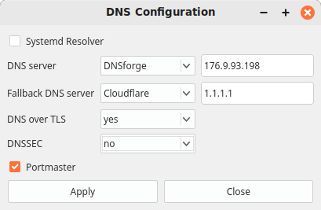

# GUI Configuration of DNS Resolution

## Overview

This project is a simple GUI interface for controlling the DNS resolvers
running on a Linux platform. It assumes that you have two different resolvers
installed, and that these resolvers can be started and stopped using systemd:

* systemd-resolved, a daemon that comes with systemd. Its configuration
  parameters are */etc/systemd/resolved.conf*.

* portmaster. It is configured via a GUI.

The configuration utility contains two components:

  * A GUI written in PyQt5 (*/usr/local/bin/dnsconf.py*); it is
    essentially an editor for the configuration file
    */etc/systemd/resolved.conf*.

  * an applet for the Cinnamon desktop that starts the GUI component
    (*/usr/share/cinnamon/applets/dnssettings@conrad.roeber*).

The applet runs on the Cinnamon desktop and interacts with systemd to switch
between Portmaster dn the system DNS resolver.

## Installation

Call *install.sh*; the shell script copies the Java Scipt and JSON files in
applet/files/${APPLET} to /usr/share/cinnamon/applets/${APPLET}, where
${APPLET} is *dnssetting@conrad.roeber*, the applet's UUID.

## Debugging

Press Alt-F2 to enter the Cinnamon debugger; in the prompt type 'lg'.

## Limitations

  * The file */etc/systemd/resolved.conf* must already exist.

  * The application handles only /etc/systemd/resolved.conf but not the other
    possible locations like /run/systemd or /usr/lib/systemd, nor does it
    handle snippets.

  * The application queries the user's password only once. If it is wrong and
    sudo fails, quit the program and start over.

## Files

/etc/systemd/resolved.conf

## See also

resolved.conf(5)
